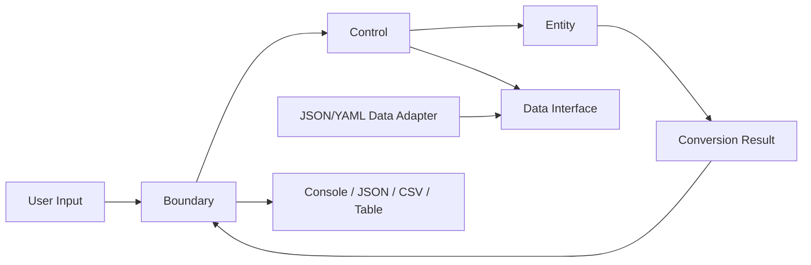

# UnitConverter_05

UnitConverter_05는 C++/클린 아키텍처 학습자가 길이 단위 변환 문제를 통해 계약 정의, 테스트 우선 검증, 레이어 분리를 학습하기 위한 C++17 기반 단위 변환 학습 시스템입니다.

## 목차

- [개요 (Overview)](#개요-overview)
- [빠른 시작 (Quick Start)](#빠른-시작-quick-start)
- [지원 단위 및 비율](#지원-단위-및-비율)
- [입력 형식 계약](#입력-형식-계약)
- [아키텍처](#아키텍처)
- [테스트 실행](#테스트-실행)
- [설정 파일 (JSON/YAML)](#설정-파일-jsonyaml)
- [출력 포맷](#출력-포맷)
- [기여 가이드 (Contributing)](#기여-가이드-contributing)
- [라이선스](#라이선스)

## 개요 (Overview)

UnitConverter_05는 `meter`, `feet`, `yard` 간 길이 변환을 다룹니다. 이 프로젝트의 핵심 문제는 변환 알고리즘 자체가 아니라 입력 형식, 오류 정책, 기준 비율, 출력 표현, 단위 확장 방식을 테스트 가능한 계약으로 고정하는 것입니다.

주요 학습 목표는 다음과 같습니다.

- OCP: 새 단위 추가가 기존 변환 계산 규칙 수정을 요구하지 않도록 설계합니다.
- SRP: 입력 파싱, 유스케이스 조정, 변환 규칙, 설정 로드, 출력 직렬화 책임을 분리합니다.
- BCE: Boundary, Control, Entity 레이어의 책임과 의존성 방향을 고정합니다.
- TDD: Catch2 기반 RED-GREEN-REFACTOR 흐름으로 계약을 먼저 보호합니다.

상세 제품 요구사항은 [docs/PRD.md](docs/PRD.md)에 정의되어 있으며, README는 PRD의 실행 관점 요약 문서입니다.

## 빠른 시작 (Quick Start)

### 사전 조건

| 항목 | 요구사항 |
|---|---|
| C++ | C++17 이상 |
| 빌드 도구 | CMake |
| 테스트 프레임워크 | Catch2 |

### 빌드 & 실행

```sh
cmake -S . -B build
cmake --build build
```

Windows 예시:

```sh
build\Debug\UnitConverter.exe
```

Unix 계열 예시:

```sh
./build/UnitConverter
```

### 예시 입출력

입력:

```text
meter:5.0
```

기본 콘솔 출력:

```text
5.0 meter = 16.4 feet
5.0 meter = 5.5 yard
```

표시 정밀도는 기본 소수점 1자리입니다. 정확도 검증은 표시 문자열이 아니라 내부 변환값을 기준으로 허용 오차 `0.00001` 이내에서 수행합니다.

## 지원 단위 및 비율

기준 단위는 `meter`입니다. `feet`와 `yard` 간 변환은 직접 비율이 아니라 항상 `meter` 기준 비율을 경유합니다.

| 단위명 | 식별자 | meter 기준 비율 | 출처 |
|---|---|---:|---|
| meter | `meter` | `1.0` | PRD 5.1 기준 단위 |
| feet | `feet` | `0.3047999902464003` | `1 meter = 3.28084 feet`의 역관계 |
| yard | `yard` | `0.9144027578387177` | `1 meter = 1.09361 yard`의 역관계 |

회귀 보호 기준:

- `1 meter = 3.28084 feet`
- `1 meter = 1.09361 yard`

## 입력 형식 계약

기본 입력 형식은 다음과 같습니다.

```text
unit:value
```

### 정상 입력

```text
meter:5.0
feet:3.28084
yard:0
```

정상 입력 계약:

- 단위명은 소문자 영문으로 시작하고 소문자 영문, 숫자, 밑줄만 포함합니다.
- 값은 십진수 숫자여야 합니다.
- 길이 값은 0 이상이어야 합니다.
- `0`은 유효한 길이이며 모든 변환 결과 값은 `0`입니다.

### 비정상 입력

| 입력 | 에러 코드 | 에러 메시지 패턴 |
|---|---|---|
| `meter` | `INVALID_FORMAT` | `Invalid input format. Expected "<unit>:<value>".` |
| `meter:2.5.1` | `INVALID_VALUE` | `Invalid value: "<value>". Use a numeric length value.` |
| `yard:-1` | `NEGATIVE_VALUE` | `Invalid value: "<value>". Length must be zero or greater.` |
| `inch:1` | `UNKNOWN_UNIT` | `Unknown unit: "<unit>". Register the unit before conversion.` |
| `:2.5` | `INVALID_UNIT_NAME` | `Invalid unit name: "<unit>". Use lowercase letters, digits, or underscore.` |
| `meter:` | `INVALID_VALUE` | `Invalid value: "<value>". Use a numeric length value.` |

실패 입력은 변환 결과를 생성하지 않습니다.

## 아키텍처



### 의존성 방향

- `Boundary -> Control`
- `Control -> Entity`
- `Control -> Data Interface`
- `Data Adapter -> Data Interface`
- `Entity`는 `Boundary`, `Control`, `Data Adapter`, 파일 시스템, 출력 포맷에 의존하지 않습니다.

### 레이어 책임

| 레이어 | 책임 |
|---|---|
| Boundary | 사용자 입력 파싱, 입력 형식 검증, 출력 포맷 직렬화, 외부 오류 메시지 생성 |
| Control | 유스케이스 흐름 조정, Boundary 요청을 Entity 호출로 연결, Data 접근 인터페이스 호출 |
| Entity | 단위 식별자, 측정값, 변환 비율, 단위 등록, 변환 계산 규칙 |

### 새 단위 추가 방법

1. 새 단위의 식별자와 `rateToMeter` 값을 정합니다.
2. JSON 또는 YAML 설정에 새 단위 정의를 추가합니다.
3. 새 단위 등록과 변환 결과에 대한 RED 테스트를 먼저 추가합니다.
4. 기존 `meter`, `feet`, `yard` 변환 테스트가 수정 없이 통과하는지 확인합니다.
5. 새 단위 추가가 Entity의 기존 변환 공식 변경을 요구하면 설계를 재검토합니다.

## 테스트 실행

테스트 프레임워크는 Catch2로 고정합니다.

```sh
cmake -S . -B build
cmake --build build
ctest --test-dir build --output-on-failure
```

### 커버리지 목표

| 영역 | 커버리지 목표 |
|---|---|
| Domain | 라인 90% 이상, 분기 85% 이상 |
| Boundary | 라인 85% 이상, 오류 분기 90% 이상 |
| Data | 라인 80% 이상, 실패 케이스 90% 이상 |
| Integration | 정상 시나리오 3개 이상, 실패 시나리오 5개 이상 |

회귀 테스트는 기준 비율, 오류 코드, 출력 필드명, 출력 열 이름의 변경을 감지해야 합니다.

## 설정 파일 (JSON/YAML)

권장 설정 위치:

```text
config/units.json
config/units.yaml
```

JSON 형식 예시:

```json
{
  "units": [
    { "id": "meter", "rateToMeter": 1.0 },
    { "id": "feet", "rateToMeter": 0.3047999902464003 },
    { "id": "yard", "rateToMeter": 0.9144027578387177 }
  ]
}
```

YAML 형식 예시:

```yaml
units:
  - id: meter
    rateToMeter: 1.0
  - id: feet
    rateToMeter: 0.3047999902464003
  - id: yard
    rateToMeter: 0.9144027578387177
```

설정 실패 계약:

| 조건 | 에러 코드 |
|---|---|
| 설정 파일 없음 | `DATA_SOURCE_NOT_FOUND` |
| 설정 형식 오류 | `DATA_PARSE_ERROR` |
| 중복 단위 | `DUPLICATE_UNIT` |
| 0 이하 비율 | `INVALID_RATE` |

### 동적 단위 등록 예시

입력 형식:

```text
register:<unit>=<rateToMeter>
```

예시:

```text
register:cubit=0.4572
```

동적 등록 계약:

- 단위명은 소문자 영문으로 시작하고 소문자 영문, 숫자, 밑줄만 포함합니다.
- `rateToMeter`는 0보다 커야 합니다.
- 등록된 새 단위는 이후 변환 대상 목록에 포함됩니다.
- 잘못된 단위명은 `INVALID_UNIT_NAME`으로 실패합니다.
- 0 이하 비율은 `INVALID_RATE`로 실패합니다.
- 중복 단위는 `DUPLICATE_UNIT`으로 실패합니다.

## 출력 포맷

모든 출력 포맷은 원 입력 단위와 원 입력 값을 보존해야 합니다. 동일 입력에 대한 JSON, CSV, 표 출력은 동일한 변환 결과 수를 표현해야 합니다.

### 콘솔

```text
5.0 meter = 16.4 feet
5.0 meter = 5.5 yard
```

콘솔 계약:

- 포맷명: `plain`
- 행 순서: 등록 단위 순서에서 입력 단위를 제외한 순서
- 행 형식: `<sourceValue> <sourceUnit> = <convertedValue> <targetUnit>`

### JSON

```json
{
  "sourceUnit": "meter",
  "sourceValue": 5.0,
  "results": [
    {
      "targetUnit": "feet",
      "convertedValue": 16.4042,
      "displayText": "5.0 meter = 16.4 feet"
    },
    {
      "targetUnit": "yard",
      "convertedValue": 5.46805,
      "displayText": "5.0 meter = 5.5 yard"
    }
  ]
}
```

JSON 실패 응답은 `errorCode`, `message`, `field`, `input`을 포함합니다.

### CSV

```csv
sourceUnit,sourceValue,targetUnit,convertedValue
meter,5.0,feet,16.4042
meter,5.0,yard,5.46805
```

CSV 계약:

- 첫 줄은 `sourceUnit,sourceValue,targetUnit,convertedValue` 고정 헤더입니다.
- 변환 결과 1개는 CSV 데이터 행 1개로 표현합니다.

### Table

```text
| Source | Value | Target | Converted |
|---|---:|---|---:|
| meter | 5.0 | feet | 16.4 |
| meter | 5.0 | yard | 5.5 |
```

표 계약:

- 열 이름은 `Source`, `Value`, `Target`, `Converted`입니다.
- 변환 결과 1개는 본문 행 1개로 표현합니다.

## 기여 가이드 (Contributing)

### 계약 변경 금지 원칙

- `1 meter = 3.28084 feet` 기준 비율 변경은 회귀로 간주합니다.
- `1 meter = 1.09361 yard` 기준 비율 변경은 회귀로 간주합니다.
- 오류 코드 문자열 변경은 회귀로 간주합니다.
- JSON 필드명, CSV 헤더, 표 열 이름 변경은 회귀로 간주합니다.
- 새 출력 포맷 추가는 기존 `plain`, `json`, `csv`, `table` 계약을 변경하지 않아야 합니다.

### 테스트 없는 PR 거부 정책

- 새 동작은 RED 테스트가 먼저 있어야 합니다.
- 입력 검증 변경은 Boundary 계약 테스트를 포함해야 합니다.
- 변환 비율 변경은 Domain 회귀 테스트를 포함해야 합니다.
- 설정 로드 변경은 Data 실패 테스트를 포함해야 합니다.
- 출력 포맷 변경은 필드명, 행 수, 원 입력 보존 테스트를 포함해야 합니다.

### 커밋 메시지 컨벤션

```text
docs: update README contract summary
test: add boundary contract cases
feat: add dynamic unit registration contract
fix: correct unknown unit error handling
refactor: separate boundary formatting responsibility
```

권장 타입:

- `docs`: 문서 변경
- `test`: 테스트 추가 또는 수정
- `feat`: 사용자 관찰 가능 기능 추가
- `fix`: 계약 위반 또는 오류 수정
- `refactor`: 동작 변경 없는 구조 개선

## 라이선스

MIT License. 이 프로젝트는 학습용으로 제공됩니다.
