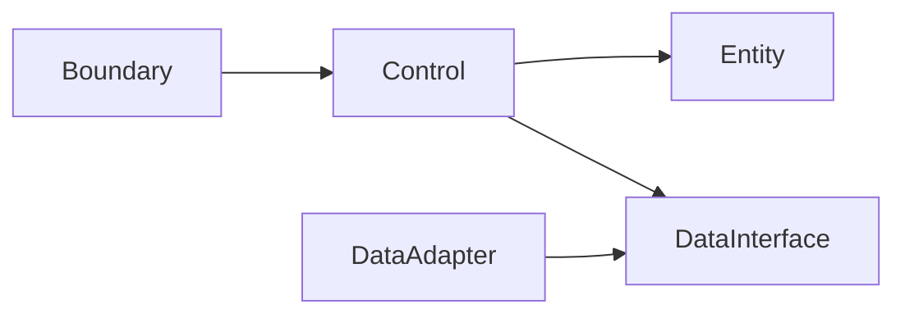

# UnitConverter_05 문서화 및 요구사항 정리 보고서

## 1. 보고서 개요

### 1.1 목적

이 보고서는 UnitConverter_05 프로젝트에서 지금까지 정리한 문제 정의, 고객 인터뷰 질문, BCE/Dual-Track 설계 관점, RED 테스트 목록, PRD, README, `.cursorrules`, To-Do 및 추적 매트릭스 내용을 하나의 문서로 요약한다.

### 1.2 범위

| 구분 | 포함 여부 | 내용 |
|---|---:|---|
| 문제 정의 | 포함 | 길이 단위 변환 문제의 학습 맥락과 핵심 invariant |
| 고객 인터뷰 | 포함 | Mom Test 기반 질문과 위험 가정 |
| 설계 관점 | 포함 | Boundary, Control, Entity 책임과 의존성 방향 |
| 테스트 전략 | 포함 | Catch2 기준 RED 테스트 분류와 회귀 보호 기준 |
| 제품 요구사항 | 포함 | Phase 5 PRD의 기능, 비기능, 데이터, 출력 요구사항 |
| 오픈소스 문서화 | 포함 | README 및 기여 가이드 요약 |
| 구현 코드 | 제외 | 코드, 클래스 설계 상세, 알고리즘 본문, 빌드 스크립트 작성은 제외 |

### 1.3 생성된 주요 산출물

| 산출물 | 경로 | 역할 |
|---|---|---|
| PRD | `docs/PRD.md` | 제품 요구사항, 인수 기준, 회귀 보호 규칙의 기준 문서 |
| README | `README.md` | 오픈소스 사용자용 실행, 계약, 아키텍처, 기여 안내 |
| Cursor Rules | `.cursorrules` | AI와 개발자가 지켜야 할 프로젝트 규칙 |
| 보고서 | `Report/UnitConverter_05_Report.md` | 지금까지의 논의와 산출물 요약 |

## 2. 문제 정의 요약

### 2.1 관찰 관점의 상황

UnitConverter_05는 사용자가 `unit:value` 형식으로 입력한 길이 값을 등록된 다른 단위로 변환해 출력하는 학습 프로젝트다. 문제의 핵심은 단위 변환 알고리즘 자체가 아니라, 입력 형식, 오류 정책, 기준 비율, 출력 표현, 단위 확장 방식을 테스트 가능한 계약으로 고정하고 변경에 강한 구조를 학습하는 것이다.

### 2.2 이 문제가 선택된 이유

| 관점 | 설명 |
|---|---|
| 검증 가능성 | meter, feet, yard 변환은 기대값을 수치로 검증하기 쉽다. |
| 설계 학습 | OCP/SRP, 책임 분리, 레지스트리 기반 확장을 다루기 좋다. |
| 테스트 학습 | 정상 변환, 역변환, 오류 입력, 출력 포맷을 RED 테스트로 표현할 수 있다. |
| 확장성 학습 | 새 단위 등록과 설정 외부화를 통해 변경 지점을 분리할 수 있다. |

### 2.3 핵심 문제 정의

표면 문제는 길이 값을 다른 단위로 변환해 출력하는 것이다. 개선된 문제 정의는 길이 단위 변환 요구사항을 계약, 테스트, 레이어 분리 관점으로 고정하고, 새 단위 추가와 출력 포맷 확장 시 기존 변환 규칙이 깨지지 않도록 보호하는 것이다.

## 3. 학습 목표 및 성공 기준

### 3.1 학습 목표

| 목표 | 설명 |
|---|---|
| 계약 우선 사고 | 입력, 출력, 오류, 기준 비율을 구현 전에 고정한다. |
| TDD 사고 | RED 테스트로 요구사항을 먼저 표현하고 Green 이후 리팩터링한다. |
| 레이어 분리 사고 | Boundary, Control, Entity 책임을 분리한다. |
| 회귀 보호 사고 | 기준 비율, 오류 코드, 출력 스키마 변경을 테스트로 감지한다. |

### 3.2 측정 가능한 성공 기준

| 영역 | 성공 기준 |
|---|---|
| Domain | 라인 커버리지 90% 이상, 분기 커버리지 85% 이상 |
| Boundary | 라인 커버리지 85% 이상, 오류 분기 커버리지 90% 이상 |
| Data | 라인 커버리지 80% 이상, 실패 케이스 커버리지 90% 이상 |
| Integration | 정상 시나리오 3개 이상, 실패 시나리오 5개 이상 |
| 회귀 보호 | README 기준 비율과 출력 계약 변경 시 테스트 실패 |

## 4. 고객 인터뷰 관점 요약

### 4.1 Mom Test 질문 방향

질문은 기능 선호가 아니라 학습자와 사용자의 실제 행동을 드러내도록 구성했다.

| 질문 축 | 확인하려는 사실 |
|---|---|
| 과거 구체 경험 | 실제로 단위 변환이나 요구사항 정리에서 어려움을 겪었는지 |
| 실제 행동 | 수동 계산, 검산, 테스트 작성, 리팩터링을 어떻게 수행했는지 |
| 돈/시간/리스크 | 오류 수정 시간, 재작업 비용, 테스트 부재로 인한 불안을 경험했는지 |

### 4.2 진짜 위험 가정

- 학습자가 단위 변환 자체보다 OCP/SRP, 테스트, 입력 검증에서 실제 어려움을 겪고 있다는 가정
- 변환 결과의 정확성 문제가 학습자에게 충분히 중요한 실패 비용으로 인식된다는 가정
- 학습자가 구현 전에 계약과 요구사항을 정리하는 활동에 시간을 투자할 의지가 있다는 가정

## 5. Phase 4 산출물 요약

### 5.1 Epic

| 항목 | 내용 |
|---|---|
| 제목 | 확장 가능한 C++ 단위 변환 학습 시스템 |
| 목적 | 단위 변환 문제를 통해 계약 정의, 테스트 우선 검증, 레이어 분리를 학습한다. |
| 핵심 성공 기준 | 커버리지 목표 달성, 계약 테스트 통과, 회귀 정책 고정 |

### 5.2 User Journey

| 단계 | 핵심 행동 | 학습 의미 |
|---|---|---|
| Awareness | 단위 변환 요구사항을 읽고 핵심 규칙을 찾는다. | 알고리즘 문제가 아니라 계약 문제로 재정의한다. |
| Entry | 입력, 출력, 오류, 기준 비율을 먼저 정리한다. | 테스트 가능한 계약을 고정한다. |
| Action | Domain과 Boundary 책임을 분리한다. | SRP와 BCE를 적용한다. |
| Validation | Domain 테스트와 Boundary 계약 테스트를 나눈다. | Dual-Track TDD를 적용한다. |
| Outcome | 기준 비율과 출력 스키마를 회귀 테스트로 보호한다. | 변경 이후에도 핵심 계약을 유지한다. |

### 5.3 User Stories

| Story ID | 제목 | 핵심 계약 |
|---|---|---|
| S1 | 입력 검증 | 잘못된 형식, 음수, 숫자 아님, unknown unit은 변환 전에 실패 |
| S2 | 레지스트리·OCP | 등록된 단위만 사용하고 새 단위 추가가 기존 변환을 깨지 않음 |
| S3 | 환산 정확도 | README 기준 비율과 meter 허브 변환을 허용 오차로 검증 |
| S4 | 출력 포맷 | 원 입력 단위와 값을 보존하고 포맷별 스키마를 고정 |
| S5 | 설정 로드 실패 | 설정 파일 없음, 형식 오류, 중복 단위, 잘못된 비율을 구분 |
| S6 | 동적 단위 등록 | `register:<unit>=<rateToMeter>` 계약으로 새 단위 등록 |

### 5.4 Gherkin 시나리오

| 시나리오 | 검증 내용 |
|---|---|
| Happy path meter 입력 | `meter:2.5`가 feet와 yard로 변환되고 meter 결과는 제외 |
| 원 입력 보존 | 출력에 원 입력 단위와 원 입력 값이 유지 |
| meter to feet | `meter:1`이 `3.28084 feet`로 변환 |
| meter to yard | `meter:1`이 `1.09361 yard`로 변환 |
| feet to yard | feet 변환이 meter 기준을 경유 |
| 소수 파싱 실패 | `meter:2.5.1`은 `INVALID_VALUE` |
| 음수 입력 | `yard:-1`은 `NEGATIVE_VALUE` |
| unknown unit | `inch:1`은 `UNKNOWN_UNIT` |

## 6. BCE 및 Dual-Track 설계 요약

### 6.1 레이어 책임

| 레이어 | 책임 | 금지 사항 |
|---|---|---|
| Boundary | 입력 파싱, 입력 형식 검증, 출력 직렬화, 외부 오류 메시지 | 변환 공식 보유 금지 |
| Control | 유스케이스 흐름 조정, Boundary와 Entity 연결, Data 인터페이스 호출 | 출력 문자열 직접 조립 금지 |
| Entity | 단위, 측정값, 비율, 레지스트리, 변환 규칙 | 파일 시스템과 출력 포맷 의존 금지 |
| Data | 단위 정의 로드, 설정 실패 구분, 저장소 어댑터 | 변환 계산 수행 금지 |

### 6.2 의존성 방향

의존성 규칙은 `Boundary -> Control -> Entity`이며, Entity는 Boundary, Data Adapter, 파일 시스템, CLI 출력 형식을 알지 않는다.

## 7. 테스트 전략 요약

### 7.1 RED 단계 테스트 분류

| 분류 | 대표 테스트 |
|---|---|
| 파싱 | `meter:2.5` 파싱 성공, 콜론 누락 실패, 빈 단위 실패 |
| 음수·0 | `meter:0` 성공, `yard:-1` 실패 |
| 미지원 단위 | `inch:1`은 `UNKNOWN_UNIT` |
| 비율 정확도 | `meter:1` to feet, `meter:1` to yard, 역변환 |
| 동적 등록 | `cubit` 등록 성공, 중복 단위 실패, 0 이하 비율 실패 |
| 출력 직렬화 | JSON, CSV, Table 스키마와 행 수 검증 |

### 7.2 회귀 보호 기준

| 보호 대상 | 회귀 기준 |
|---|---|
| 기준 비율 | `1 meter = 3.28084 feet`, `1 meter = 1.09361 yard` 변경 시 실패 |
| 오류 코드 | 계약된 오류 코드 문자열 변경 시 실패 |
| JSON | 필드명 변경 시 실패 |
| CSV | 헤더 변경 시 실패 |
| Table | 열 이름 변경 시 실패 |
| 출력 포맷 확장 | 기존 `plain`, `json`, `csv`, `table` 계약 변경 시 실패 |

## 8. PRD 요약

### 8.1 기능 요구사항

| 우선순위 | 기능 |
|---|---|
| 필수 | 입력 파싱, 입력 검증, 기본 단위 변환, 원 입력 보존 출력, 레지스트리 기반 관리 |
| 권장 | 설정 외부화, JSON 출력, CSV 출력, 표 출력 |
| 선택 | 동적 단위 등록 |

### 8.2 입력 계약

| 입력 유형 | 계약 |
|---|---|
| 정상 입력 | `unit:value` |
| 빈 단위 | `INVALID_UNIT_NAME` |
| 빈 값 | `INVALID_VALUE` |
| 잘못된 형식 | `INVALID_FORMAT` |
| 잘못된 숫자 | `INVALID_VALUE` |
| 음수 | `NEGATIVE_VALUE` |
| 미지원 단위 | `UNKNOWN_UNIT` |

### 8.3 데이터 계약

| 단위 | 식별자 | meter 기준 비율 | 검증 기준 |
|---|---|---:|---|
| meter | `meter` | `1.0` | 기준 단위 |
| feet | `feet` | `0.3047999902464003` | `1 meter = 3.28084 feet`의 역관계 |
| yard | `yard` | `0.9144027578387177` | `1 meter = 1.09361 yard`의 역관계 |

## 9. README 요약 및 PRD 대조 결과

### 9.1 README 반영 내용

| 항목 | 반영 여부 |
|---|---:|
| 프로젝트 한 줄 설명 | 반영 |
| 목차 | 반영 |
| Overview | 반영 |
| Quick Start | 반영 |
| 지원 단위 및 비율 | 반영 |
| 입력 형식 계약 | 반영 |
| BCE 아키텍처 다이어그램 | 반영 |
| 테스트 실행 및 커버리지 목표 | 반영 |
| JSON/YAML 설정 예시 | 반영 |
| 출력 포맷 예시 | 반영 |
| 기여 가이드 | 반영 |
| 라이선스 | 반영 |

### 9.2 README와 PRD 비교에서 확인된 차이

- README에는 PRD의 비목표가 별도 섹션으로 명시되어 있지 않다.
- README에는 PRD의 타깃 사용자 실패 비용과 주요 사용 시나리오 표가 직접 포함되어 있지 않다.
- README에는 `UNSUPPORTED_OUTPUT_FORMAT` 실패 계약이 빠져 있다.
- README에는 콜론이 2개 이상인 입력의 `INVALID_FORMAT` 예시가 빠져 있다.
- README에는 결정성 계약이 명시적으로 드러나지 않는다.
- README의 `config/units.json`, `config/units.yaml` 권장 위치는 PRD보다 구체적인 추가 정책이다.
- README의 커밋 메시지 컨벤션과 테스트 없는 PR 거부 정책은 PRD 범위를 넘어선 오픈소스 운영 정책이다.
- 커버리지 목표는 PRD와 README가 일치한다.

## 10. `.cursorrules` 요약

### 10.1 핵심 규칙

| 영역 | 규칙 |
|---|---|
| Project | C++17 기반 UnitConverter 학습 프로젝트 |
| Code Style | clang-format, PascalCase 타입, camelCase 함수·변수, snake_case 파일 |
| Architecture | Boundary-Control-Entity 의존성 방향 고정 |
| TDD | RED 먼저, 최소 Green, Green 이후 Refactor |
| Testing | Catch2, AAA, 커버리지 목표 고정 |
| Forbidden | 디버그 cout 남발, 매직 넘버 중복, catch(...) 삼키기, 헤더 내 구현, 전역 상태 남용 금지 |
| AI Behavior | 레이어 위반 금지, 테스트 먼저, 구현 전 계약 정리 |

### 10.2 AI 행동 기준

AI는 레이어 의존성 방향을 위반하는 코드를 제안하지 않아야 한다. 새 동작을 구현하기 전에는 실패 테스트를 먼저 제안하거나 작성해야 한다. 문서 생성 요청에서는 구현 코드, 클래스 설계, 빌드 스크립트를 추가하지 않아야 한다.

## 11. To-Do 및 추적성 요약

### 11.1 Story-To-Do 추적 매트릭스 요약

| Story ID | Story 제목 | 연결된 작업 상태 |
|---|---|---|
| S1 | 입력 검증 | 파싱, 형식 오류, 빈 단위, 빈 값, 숫자 오류, 음수, 0, unknown unit 작업으로 연결 |
| S2 | 레지스트리·OCP | 레지스트리 관리, 입력 단위 제외, 새 단위 추가 후 기존 테스트 유지로 연결 |
| S3 | 환산 정확도 | meter→feet, meter→yard, 역변환, 교차 변환, 결정성 검증으로 연결 |
| S4 | 출력 포맷 | 콘솔, JSON, CSV, 표, 원 입력 보존, 결과 수 일치로 연결 |
| S5 | 설정 로드 실패 | JSON 로드, 파일 없음, 형식 오류, 중복 단위, 잘못된 비율로 연결 |
| S6 | 동적 단위 등록 | 동적 등록 명령, 실패 계약, 기존 테스트 유지로 연결 |

### 11.2 누락된 To-Do

- 기본 레지스트리 자체의 중복 등록 실패가 독립 To-Do로 분리되어 있지 않다.
- `UNSUPPORTED_OUTPUT_FORMAT` 실패 To-Do가 없다.
- 설정 필수 필드 누락 실패 To-Do가 없다.
- 동적 등록 실패 조건이 하나의 To-Do로 묶여 있어 개별 추적성이 낮다.

### 11.3 고아 To-Do

- Domain, Boundary, Data 커버리지 목표 달성은 PRD 4.3에는 연결되지만 특정 User Story 하나에는 직접 속하지 않는다.
- YAML 설정 로드 지원은 PRD 5.2에는 연결되지만 Phase 4 핵심 User Story에는 독립 Story로 존재하지 않는다.
- 새 출력 포맷 추가 가이드 문서화는 README/기여 문서 성격이며 PRD 기능 요구사항과 직접 대응하지 않는다.
- 통합 테스트 시나리오 8개 이상 확장은 품질 확장 항목이며 PRD의 최소 통합 기준을 넘어선다.

## 12. 마일스톤 요약

| 마일스톤 | 포함 항목 | 상태 |
|---|---|---|
| M1 계약 고정 | 입력 파싱, 입력 검증, 기본 단위 변환 | 예정 |
| M2 Domain 회귀 보호 | 기준 비율, 역변환, 교차 변환 | 예정 |
| M3 Boundary 출력 계약 | 콘솔, JSON, CSV, 표 출력 | 예정 |
| M4 Data 실패 계약 | 설정 외부화, 설정 실패 | 예정 |
| M5 v1.0 릴리스 검증 | 커버리지 목표, 회귀 보호 | 예정 |
| M6 v2.0 후보 검토 | 동적 단위 등록, YAML 설정 로드 | 예정 |

## 13. 남은 리스크와 권장 후속 작업

### 13.1 남은 리스크

| 리스크 | 영향 |
|---|---|
| README와 PRD 일부 계약 차이 | 구현자가 README만 보고 누락된 실패 계약을 놓칠 수 있다. |
| To-Do 문서가 파일로 저장되지 않음 | 작업 추적이 대화 기록에 의존할 수 있다. |
| Gherkin이 문서 파일로 분리되지 않음 | 계약 테스트 작성 시 시나리오 참조가 어렵다. |
| 동적 등록과 설정 외부화 범위가 넓음 | v1.0과 v2.0 범위가 혼동될 수 있다. |

### 13.2 권장 후속 작업

- README에 `UNSUPPORTED_OUTPUT_FORMAT`, 콜론 2개 이상 입력, 결정성 계약을 보강한다.
- To-Do 리스트를 `Report` 또는 `docs` 하위 문서로 저장한다.
- Phase 4 Gherkin 시나리오를 별도 요구사항 문서로 분리한다.
- v1.0 필수 범위와 v2.0 후보 범위를 마일스톤 기준으로 재확인한다.

## 14. 결론

UnitConverter_05는 단위 변환 계산기를 만드는 프로젝트가 아니라, C++17 환경에서 계약 정의, 테스트 우선 검증, BCE 레이어 분리, 회귀 보호를 학습하기 위한 요구사항 중심 프로젝트로 정리되었다. 현재 PRD, README, `.cursorrules`는 핵심 방향을 공유하고 있으며, 남은 작업은 문서 간 계약 차이를 줄이고 To-Do와 Gherkin을 독립 문서로 고정하는 것이다.
